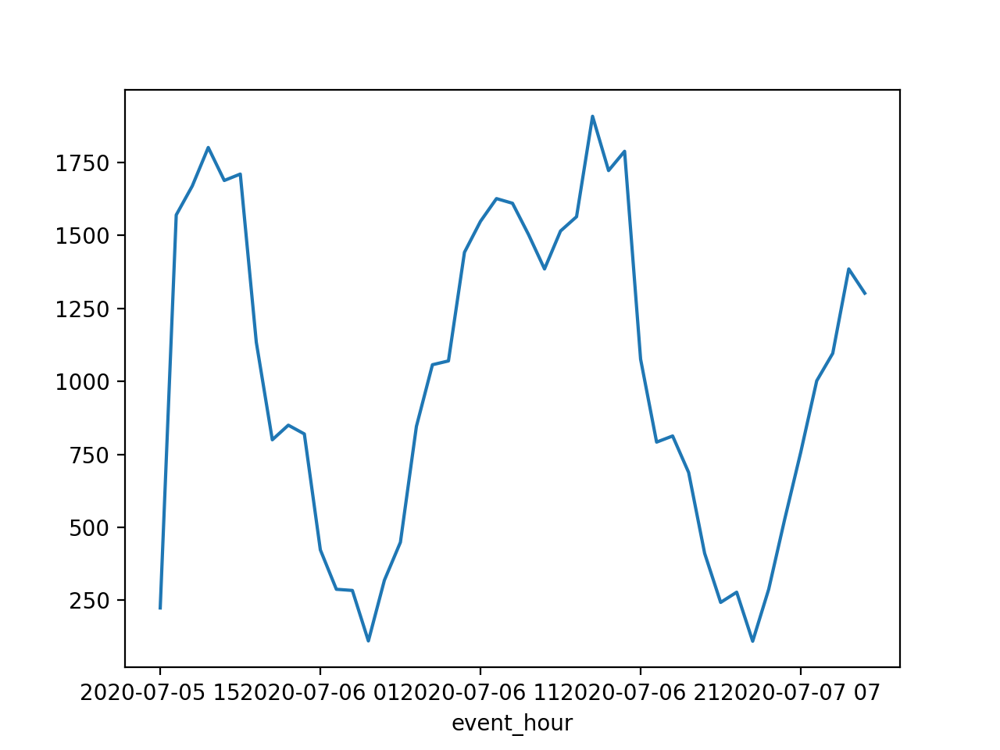

# Fake Web Events

Generator of semi-random fake web events. 

When prototyping event streaming and analytics tools such as Kinesis, Kafka, Spark Streaming, you usually want to 
have a fake stream of events to test your application. However you will not want to test it with complete 
random events, they must have some logic and constraints to become similar to the real world.

This package generates semi-random web events for your prototypes, so that when you build some charts 
out of the event stream, they are not completely random. This is a typical fake event generated with this package:

```json
{
  "event_timestamp": "2020-07-05 14:32:45.407110",
  "event_type": "pageview",
  "page_url": "http://www.dummywebsite.com/home",
  "page_url_path": "/home",
  "referer_url": "www.instagram.com",
  "referer_url_scheme": "http",
  "referer_url_port": "80",
  "referer_medium": "internal",
  "utm_medium": "organic",
  "utm_source": "instagram",
  "utm_content": "ad_2",
  "utm_campaign": "campaign_2",
  "click_id": "b6b1a8ad-88ca-4fc7-b269-6c9efbbdad55",
  "geo_latitude": "41.75338",
  "geo_longitude": "-86.11084",
  "geo_country": "US",
  "geo_timezone": "America/Indiana/Indianapolis",
  "geo_region_name": "Granger",
  "ip_address": "209.139.207.244",
  "browser_name": "Firefox",
  "browser_user_agent": "Mozilla/5.0 (Macintosh; U; PPC Mac OS X 10_5_5; rv:1.9.6.20) Gecko/2012-06-06 09:24:19 Firefox/3.6.20",
  "browser_language": "tn_ZA",
  "os": "Android 2.0.1",
  "os_name": "Android",
  "os_timezone": "America/Indiana/Indianapolis",
  "device_type": "Mobile",
  "device_is_mobile": true,
  "user_custom_id": "vsnyder@hotmail.com",
  "user_domain_id": "3d648067-9088-4d7e-ad32-45d009e8246a"
}
```

## Installation
To install simply do `pip install fake_web_events`

## Running
It is easy to run a simulation as well:
```python
from fake_web_events import Simulation


simulation = Simulation(user_pool_size=10000, sessions_per_day=100000)
events = simulation.run(duration_seconds=60)

for event in events:
    print(event)
```

## How it works
We create fake users, then generate session events based on a set of probabilities.

### Probabilities
There is a configuration file where we define a set of probabilities for each event. Let's say browser preference:
```yaml
browsers:
  Chrome: 0.5
  Firefox: 0.25
  InternetExplorer: 0.05
  Safari: 0.1
  Opera: 0.1
```

Also, when a user is in a determined page, there are some defined probabilities of what 
are the next page he's going to visit:
```yaml
home:
  home: 0.45
  product_a: 0.17
  product_b: 0.12
  session_end: 0.26
```
This means that at the next iteration there are 45% chance user stays at home page, 
17% chance user goes to product_a page and so on.

### Website Map
We designed a really simple website map to allow user browsing.


Green pages are those where a user can land at the beginning of a session. 
Yellow pages are only accessible to user who are already browsing.

You can fin how the probabilities for each page are defined in the 
[config.template.yml](fake_web_events/config.template.yml) file

### Fake user information
To generate fake user information, such as IP and email addresses we are using the module [Faker](https://github.com/joke2k/faker).

### User Pool
We create a user pool from where users are randomly chosen (with replacement). This enables users to have different sessions over time.

### Simulation
When you run a simulation, it will pick an user and iterate until that user reaches session_end. 
Simulation will run in steps defined by `batch_size`. The default `batch_size` is 10 seconds, meaning that 
each iteration will add 10 seconds to the timer (with some randomness).

For each iteration an event is generated for each user when the current page is different from the previous page.

### Simulate events
When calling `simulate_events()` you have to define a duration in seconds. Please note that this duration is in "real time", 
and that time inside the simulation will usually run faster than real time.

This will return a generator, so you need to iterate over it and decide what to do to each event inside the loop.

## Advanced
If you want to customize the probabilities, you can create a file called `config.yml` in the same 
directory where you are running the script. This file will take precedence over [config.template.yml](fake_web_events/config.template.yml).

# Examples
In the folder [examples](examples) you are going to find some use cases and examples on how to use this package.

## Page visit distribution
After running the simulation for a few seconds, we get the following distribution of events per page:
```
page             count
/home            20202
/product_a       11503
/product_b        7571
/cart             5054
/payment          3364
/confirmation     2481
```

## Sessions per hour
We also have different visit rates per hour of day. This is the distribution after running the simulation:


# Wanna help?
Fork, improve and PR.
